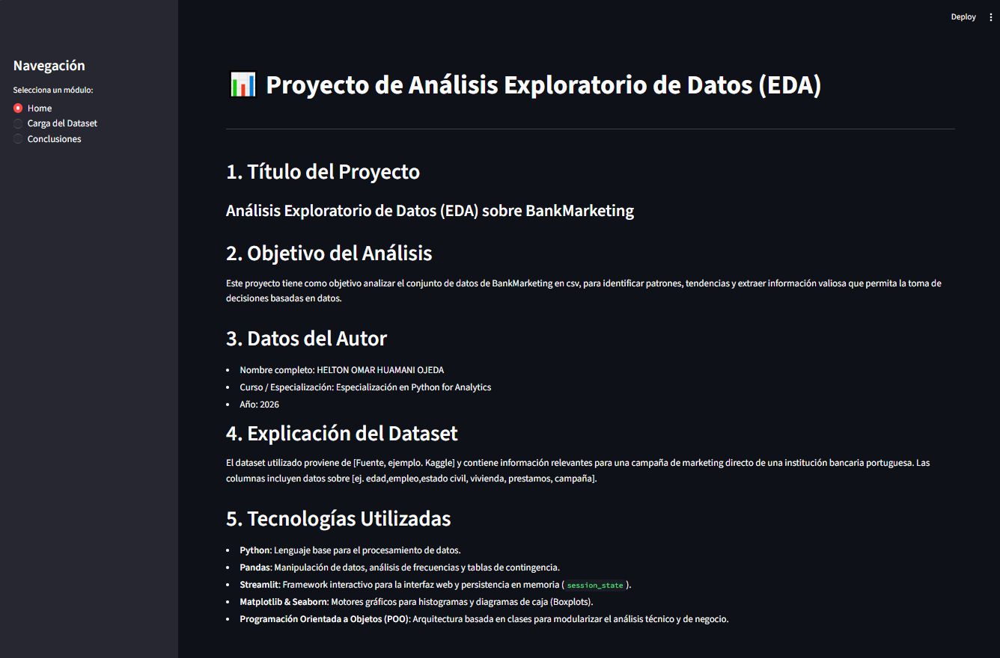
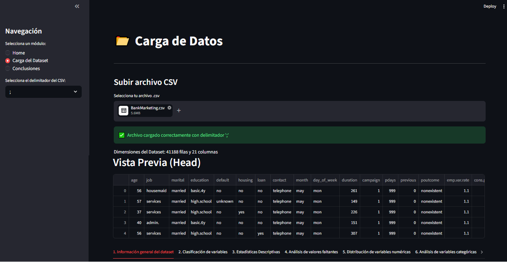
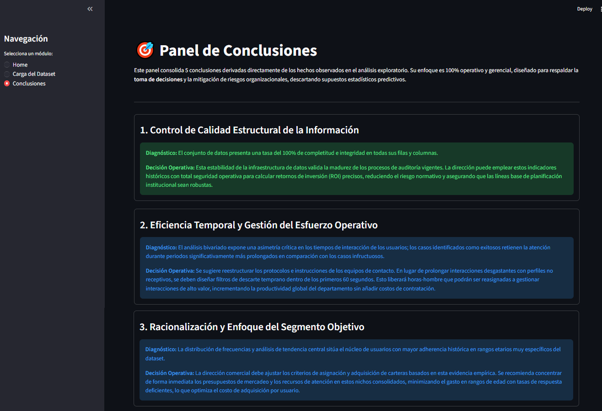

# 📊 Analizador Exploratorio de Datos Interactivo (EDA)
## 📝 Descripción del Proyecto
Esta aplicación web interactiva ha sido desarrollada en Python utilizando el framework Streamlit. El sistema permite cargar archivos estructurados (`.csv`) delimitados por punto y coma (`;`) para realizar un Análisis Exploratorio de Datos (EDA) automatizado. 

El diseño está estructurado e incluye tres módulos principales:
1. **Home**: Presentación del proyecto, tecnologías y datos del autor.
2. **Carga y Análisis**: Procesamiento técnico de 10 ítems estadísticos y gráficos en tiempo real.
3. **Conclusiones Estratégicas**: Un panel ejecutivo orientado al diagnóstico operativo y la toma de decisiones empresariales (sin enfoque predictivo).

---

## 📸 Capturas de la Aplicación
### 1. Módulo 1: Vista de Bienvenida (Home)


### 2. Módulo 2: Carga del Dataset


### 3. Módulo 3: Conclusiones


---

## 🚀 Instrucciones de Ejecución

Sigue estos pasos secuenciales para configurar el entorno y ejecutar la aplicación de forma local en tu computadora:

### 1. Ubicar la Carpeta del Proyecto
Abre la terminal de tu sistema operativo (Símbolo del sistema, PowerShell o la terminal integrada de tu editor de código como VS Code) y navega hasta el directorio raíz donde se encuentra alojado el archivo `app.py`:
```bash
cd "C:\Users\User\Desktop\CLASES DMC\Especialización en Python for Analytics\Evaluación final trabajo práctico - 60% (04052026 - 18052026)"
```

### 2. Instalar las Dependencias Técnicas
El núcleo de la aplicación requiere un conjunto de librerías específicas para el procesamiento de datos, visualización y despliegue de interfaz. Instálalas ejecutando el siguiente comando en tu terminal:
```bash
pip install streamlit pandas matplotlib seaborn
```

### 3. Lanzar el Servidor de Streamlit
Una vez que las librerías se hayan instalado correctamente, inicia el servidor local de desarrollo con el comando:
```bash
streamlit run app.py
```

### 4. Acceder a la Interfaz Web
Al ejecutar el paso anterior, el framework levantará un servicio web local. Tu navegador predeterminado se abrirá de manera automática. En caso de que no lo haga, puedes acceder manualmente copiando y pegando la siguiente dirección URL:
```text
http://localhost:8501
```

---

### ⚙️ Secuencia de Operación en la Plataforma
* **Paso 1:** Valida la información del autor y el marco tecnológico en el **Módulo 1: Home**.
* **Paso 2:** Dirígete al **Módulo 2**, carga tu archivo `.csv` con separador de punto y coma (`;`) y explora de manera interactiva las pestañas de análisis que componen los 10 ítems analíticos.
* **Paso 3:** Una vez cargados los datos, navega hacia el **Módulo 3: Conclusiones Estratégicas** para revisar los reportes y diagnósticos gerenciales orientados a la toma de decisiones corporativas.

---

## 🔗 Links Relevantes
* **Repositorio del Código Fuente**: [GitHub - Proyecto EDA](https://github.com/heltonhuamani-art/An-lisis-Exploratorio-de-Datos-EDA-.git)